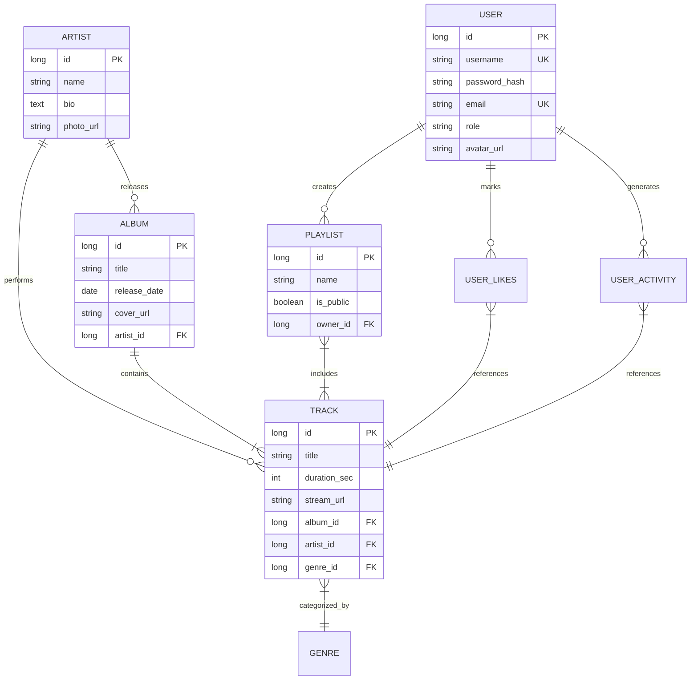

# Diagrama Entidad-Relación (ER) - Spotifake

Utilizamos la notación de Mermaid para representar las relaciones entre las entidades del sistema.

## Relaciones Críticas
1. **User - Playlist (1:N):** Un usuario puede ser dueño de muchas listas.
2. **Playlist - Track (M:N):** Una canción puede estar en muchas listas y una lista tiene muchas canciones.
3. **Artist - Album (1:N):** Un álbum pertenece a un solo artista principal (simplificación inicial).
4. **UserActivity (1:N):** Registro histórico para el "Feed" de la Home.
